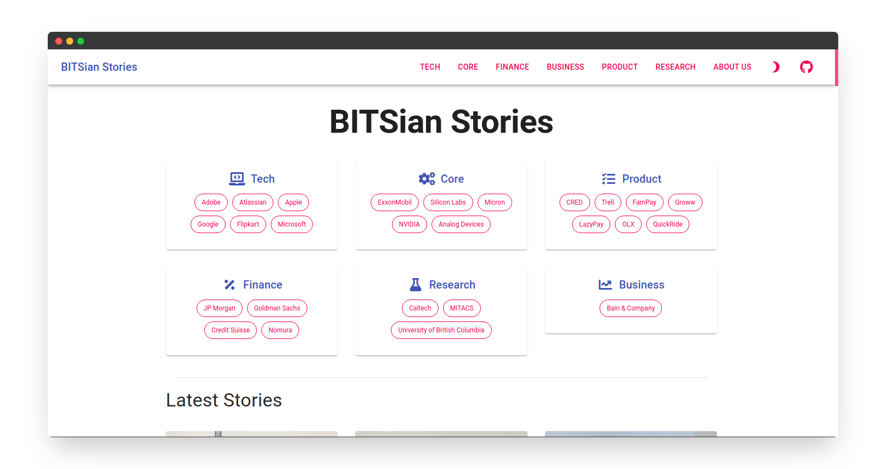
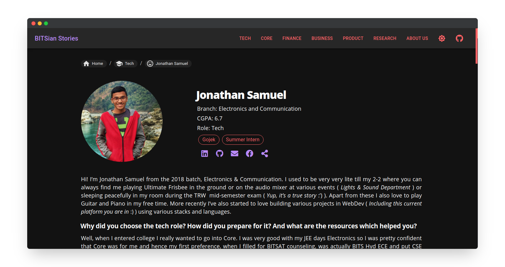

# BITSian Stories

## About

<i>
“What do we propose to do here? We want to teach real science whether it is engineering, chemistry, humanities, physics or any other branch. We want to develop a scientific approach in Pilani, which means there would be no dogma. There will be a search for truth. What we propose to do here is to cultivate a scientific mind.”</i>

The Late Shri G.D. Birla  
Founder Chairman, BITS, Pilani

<strong>
With this vision in mind, thousands of BITSians have achieved a remarkable feat in their lives. Through the initiative of ‘BITSian Stories’, we wish to bring the experiences and anecdotes of some incredible BITSians who have done fantastic in the area of their interests so that the upcoming batches can learn from their wisdom and knowledge and take the legacy forward!</strong>

## Screenshots

